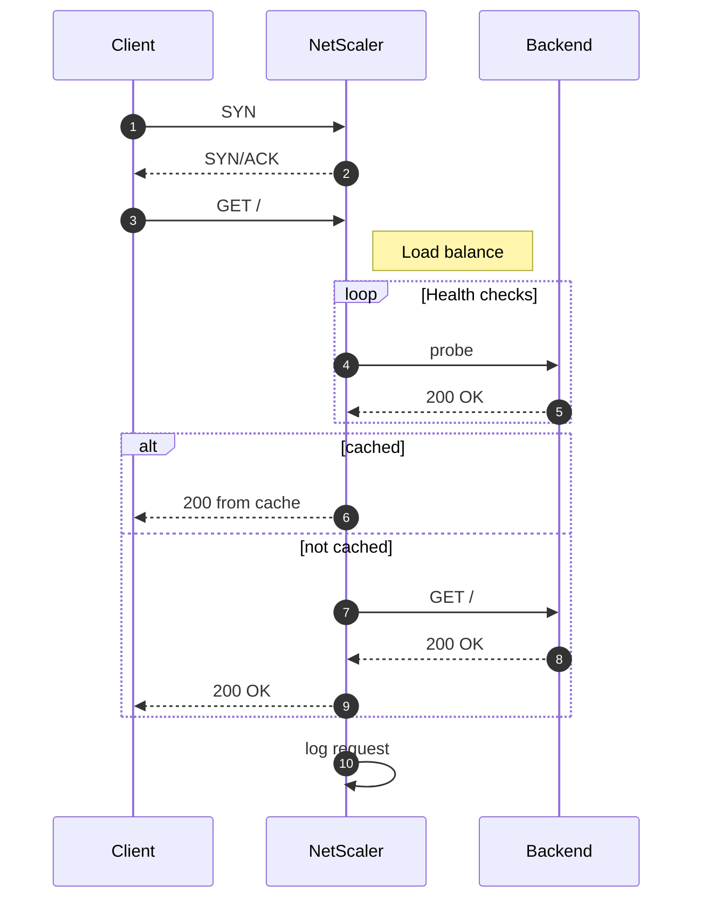
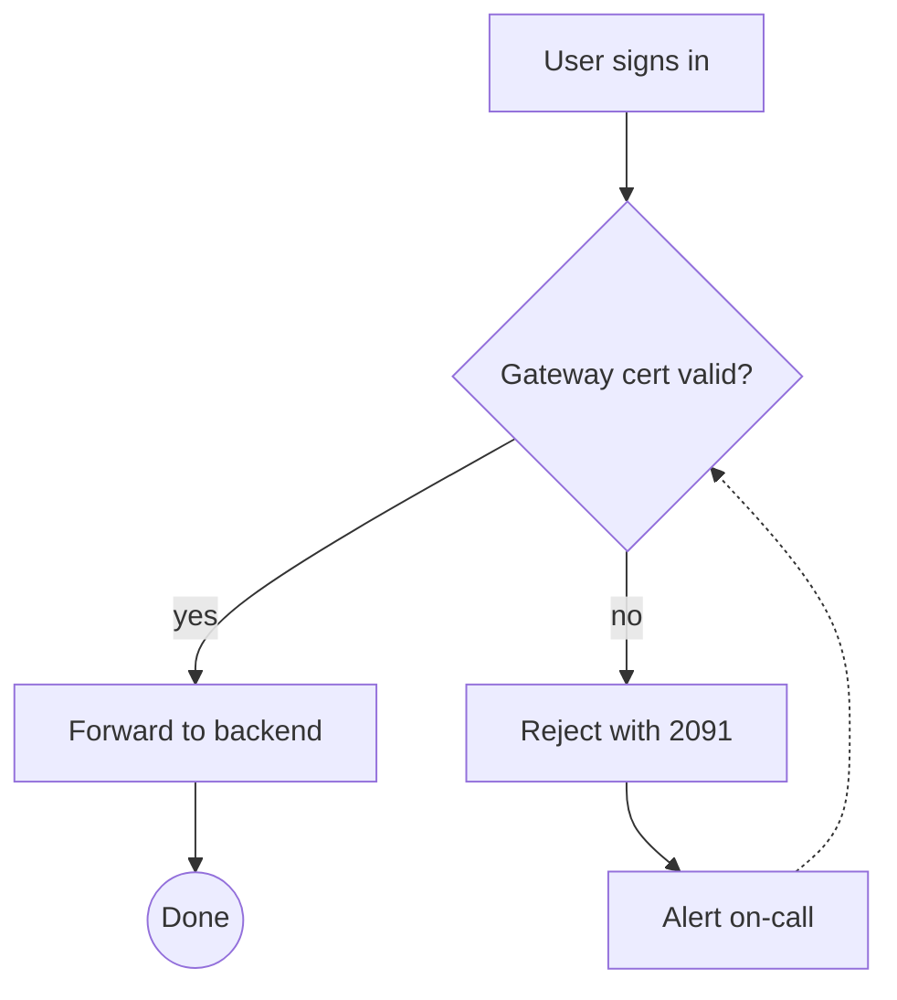
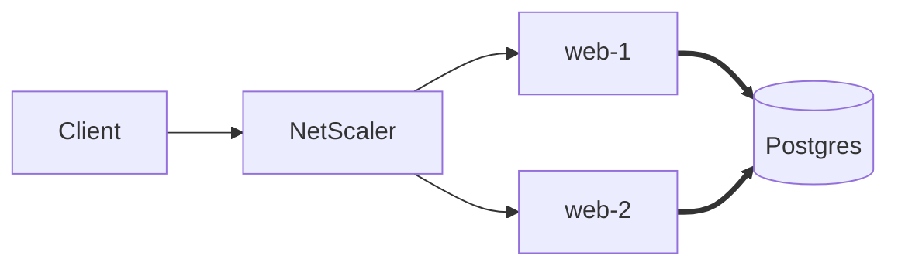
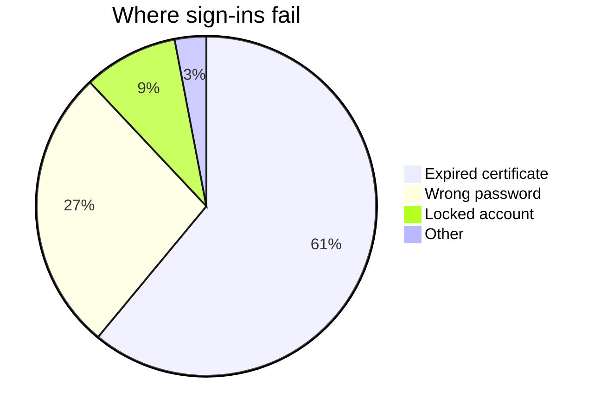
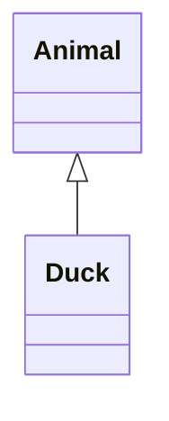

# Diagrams

A ladder chart:

```mermaid
sequenceDiagram
    autonumber
    participant C as Client
    participant N as NetScaler
    participant B as Backend
    C->>N: SYN
    N-->>C: SYN/ACK
    C->>N: GET /
    Note right of N: Load balance
    loop Health checks
        N->>B: probe
        B-->>N: 200 OK
    end
    alt cached
        N-->>C: 200 from cache
    else not cached
        N->>B: GET /
        B-->>N: 200 OK
        N-->>C: 200 OK
    end
    N->>N: log request
```

A flowchart:

```mermaid
flowchart TD
    A[User signs in] --> B{Gateway cert valid?}
    B -->|yes| C[Forward to backend]
    B -->|no| D[Reject with 2091]
    C --> E((Done))
    D --> F[Alert on-call]
    F -.-> B
```

Left to right:

```mermaid
graph LR
    Client --> LB[NetScaler] --> S1[web-1] & S2[web-2]
    S1 ==> DB[(Postgres)]
    S2 ==> DB
```

A pie chart:

```mermaid
pie title Where sign-ins fail
    "Expired certificate" : 61
    "Wrong password" : 27
    "Locked account" : 9
    "Other" : 3
```

A class diagram (not drawn as text):

```mermaid
classDiagram
    Animal <|-- Duck
```
