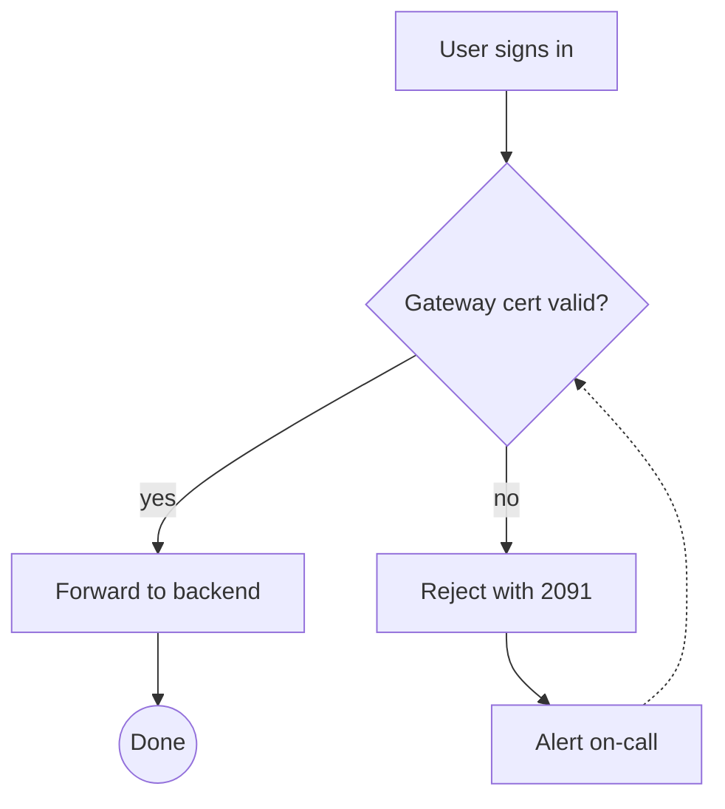
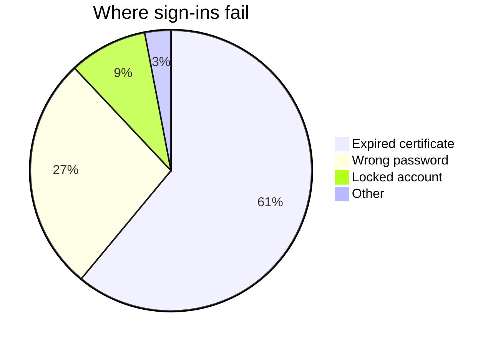

# Sign-in decision

```mermaid
flowchart TD
    A[User signs in] --> B{Gateway cert valid?}
    B -->|yes| C[Forward to backend]
    B -->|no| D[Reject with 2091]
    C --> E((Done))
    D --> F[Alert on-call]
    F -.-> B
```

```mermaid
pie title Where sign-ins fail
    "Expired certificate" : 61
    "Wrong password" : 27
    "Locked account" : 9
    "Other" : 3
```
