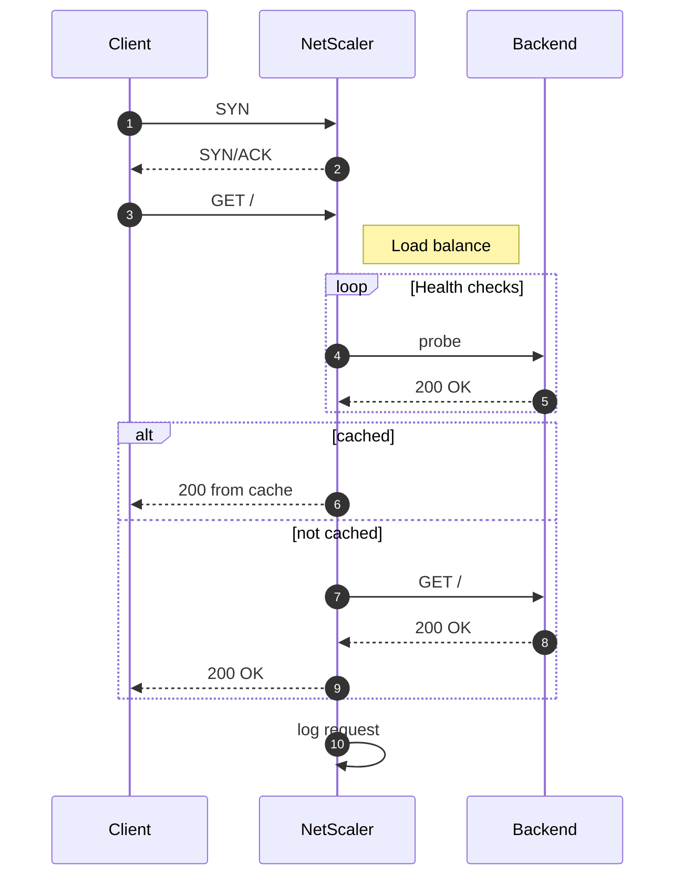

# Login flow

```mermaid
sequenceDiagram
    autonumber
    participant C as Client
    participant N as NetScaler
    participant B as Backend
    C->>N: SYN
    N-->>C: SYN/ACK
    C->>N: GET /
    Note right of N: Load balance
    loop Health checks
        N->>B: probe
        B-->>N: 200 OK
    end
    alt cached
        N-->>C: 200 from cache
    else not cached
        N->>B: GET /
        B-->>N: 200 OK
        N-->>C: 200 OK
    end
    N->>N: log request
```
